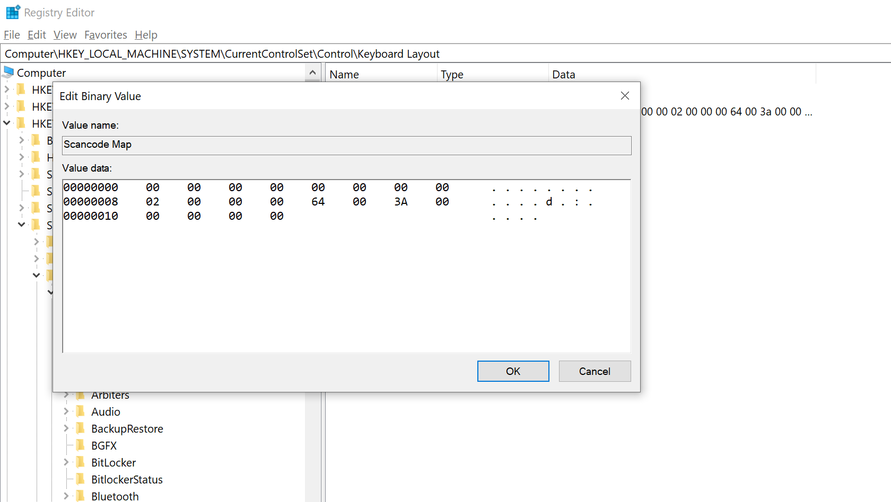
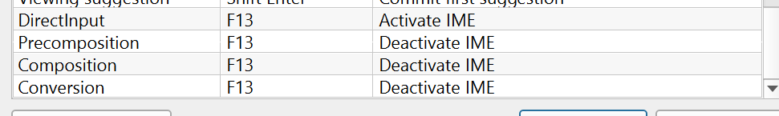

### Make Capslock key to a language switch key!
Assign F13 key as a Capslock key, then F13 as a IME activate/deactivate switch
1. install google japanese input
2. Run "regedit" and edit Scancode map -> [source](https://www.youtube.com/watch?v=PlPoG7MAt_g)

3. Go to IME options -> properties and add these four lines

