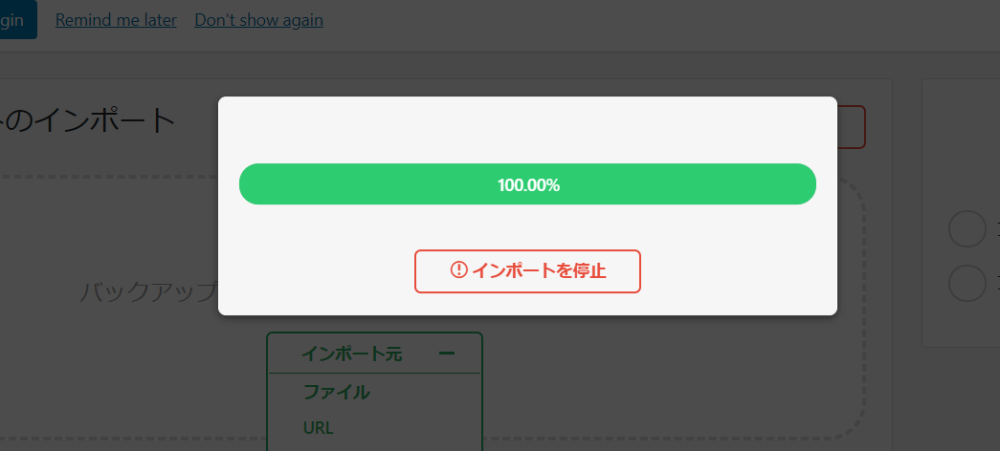

### docker image, use it with the aiz template docker image!
Wordpress docker image
```docker
version: '3.6'
services:
    database:
        image: mysql:5.7
        command:
            - "--character-set-server=utf8"
            - "--collation-server=utf8_unicode_ci"
        ports:
            - "3306:3306"
        restart: on-failure:5
        container_name: "${PRODUCTION_NAME}_db"
        volumes:
            - db-data:/var/lib/mysql
        environment:
            MYSQL_USER: wordpress
            MYSQL_DATABASE: wordpress
            MYSQL_PASSWORD: wordpress
            MYSQL_ROOT_PASSWORD: wordpress
        networks:
            - back_bridge
    wordpress:
        depends_on:
            - database
        image: wordpress:latest
        container_name: "${PRODUCTION_NAME}_wordpress"
        restart: on-failure:5
        expose:
            - "80"
        volumes:
            - ./wordpress:/var/www/html
        env_file: .env
        environment:
            WORDPRESS_DB_HOST: database:3306
            WORDPRESS_DB_PASSWORD: wordpress
            VIRTUAL_HOST: "${PRODUCTION_NAME}.localhost"
            LETSENCRYPT_HOST: "${PRODUCTION_NAME}.localhost"
            LETSENCRYPT_EMAIL: info@localhost
        networks:
            - front_bridge
            - back_bridge
    webpack:
        image: aiz_webpack:1.1.9
        volumes:
            - ./wordpress/wp-content/themes/kisimo_v3/assets/webpack/src:/webpack/src
            - ./wordpress/wp-content/themes/kisimo_v3/assets/webpack/dist:/webpack/dist
volumes:
    db-data:

networks:
    front_bridge:
        external: true
    back_bridge:
        driver: bridge
```
nginx docker image
```
version: '3.6'

services:
    nginx-proxy:
        container_name: nginx_proxy
        image: jwilder/nginx-proxy
        ports:
            - "80:80"
            - "443:443"
        volumes:
            - html:/usr/share/nginx/html
            - dhparam:/etc/nginx/dhparam
            - vhost:/etc/nginx/vhost.d
            - certs:/etc/nginx/certs:ro
            - /var/run/docker.sock:/tmp/docker.sock:ro
        labels:
            - "com.github.jrcs.letsencrypt_nginx_proxy_companion.nginx_proxy"
        restart: always
        environment:
            TZ: Asia/Tokyo
        networks:
            - front_bridge
    # letsencrypt-nginx-proxy-companion:
    #     image: jrcs/letsencrypt-nginx-proxy-companion
    #     container_name: nginx-proxy-lets-encrypt
    #     restart: always
    #     depends_on:
    #         - "nginx-proxy"
    #     volumes:
    #         - certs:/etc/nginx/certs:rw
    #         - vhost:/etc/nginx/vhost.d
    #         - html:/usr/share/nginx/html
    #         - /var/run/docker.sock:/var/run/docker.sock:ro
    #     environment:
    #         NGINX_PROXY_CONTAINER: nginx-proxy
    #     networks:
    #         - front_bridge

volumes:
    certs:
    html:
    vhost:
    dhparam:

networks:
    front_bridge:
        external: true

```

# Problems

### Fail to import All-in-One WP Migration

Error "413 request entity too large"
It was caused by nginx upload limit or wordpress upload limit.
1. nginx
```
docker exec -it {container id} bash
apt-get update
apt-get install vim
vi ../etc/nginx/nginx.conf
```
Then add this line to html section,
```
http {
...
    keepalive_timeout 65;
    client_max_body_size 512M;
}
```
2. wordpress
Add these lines to .htaccess file
```
php_value upload_max_filesize 2G
php_value post_max_size 2G
php_value memory_limit 2G
php_value max_execution_time 600
php_value max_input_time 600
```

### The requested URL /about was not found on this server.
Error message, there is not such url on this server...
```
Not Found

The requested URL /about was not found on this server.

Apache/2 Server at www.wildlionmedia.co.uk Port 80
```
When this error message appears, add these lines in .htaccess file.
```
# BEGIN WordPress
<IfModule mod_rewrite.c>
RewriteEngine On
RewriteBase /
RewriteRule ^index\.php$ - [L]
RewriteCond %{REQUEST_FILENAME} !-f
RewriteCond %{REQUEST_FILENAME} !-d
RewriteRule . /index.php [L]
</IfModule>
# END WordPress
```

### Just quick start WP docker file
```
version: '3.6'

services:
   db:
     image: mysql:5.7
     volumes:
       - db_data:/var/lib/mysql
     restart: always
     environment:
       MYSQL_ROOT_PASSWORD: wordpress
       MYSQL_DATABASE: wordpress
       MYSQL_USER: wordpress
       MYSQL_PASSWORD: wordpress

   wordpress:
     depends_on:
       - db
     image: wordpress:latest
     ports:
       - "8000:80"
     restart: always
     environment:
       WORDPRESS_DB_HOST: db:3306
       WORDPRESS_DB_USER: wordpress
       WORDPRESS_DB_PASSWORD: wordpress
       WORDPRESS_DB_NAME: wordpress
     working_dir: /var/www/html
     volumes:
      - ./wordpress/wp-content:/var/www/html/wp-content
volumes:
    db_data: {}
```
